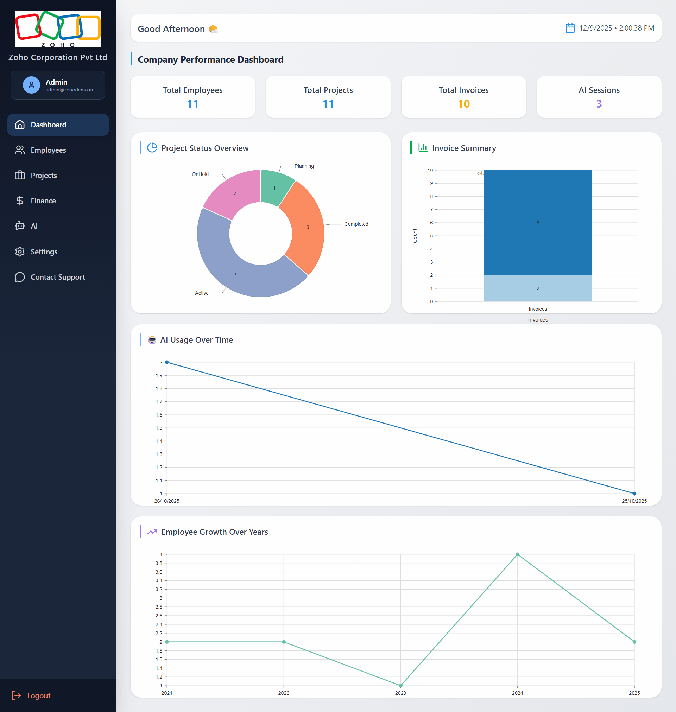

# **NexoraSpace**

## **Description**

**NexoraSpace** is a secure, production-grade Multi-Tenant SaaS platform built using the MERN stack. It enables organizations to manage employees, projects, billing, documents, and AI-powered workflows in a fully isolated tenant environment.  
The platform includes an advanced RBAC system, Google Gemini AI integration, structured file storage, dynamic PDF generation, and both System Admin and Company Admin portals.

NexoraSpace is built for:

- System Owners who manage companies (tenants)
- Organizations that use the platform for internal operations
- Teams looking to leverage AI to analyze project documents like SRS files

---

## **Project Preview**



Live Demo: https://nexoraspace.vishalsharmadev.in/

---

## **Table of Contents**

1. Introduction  
2. Architecture Overview  
3. Multi-Tenant Model  
4. RBAC Model  
5. AI Workflow  
6. Features  
7. Technologies Used  
8. Installation  
9. Usage  
10. Contributing  
11. License  
12. Contact  

---

# **Introduction**

NexoraSpace provides a structured environment where companies can:

- Manage employees, projects, billing, and documents  
- Use AI to analyze uploaded SRS files  
- Securely store files with automatic folder organization  
- Track dashboard analytics  
- Generate invoices with PDF export  
- Switch features on/off based on subscription  

The platform includes:

- A **System Admin Portal** (`/system/*`)  
- A **Company Tenant Portal** (`/company/*`)  
- Full **Role-Based Access Control**  
- **Multi-Tenant Isolation** using `companyRef`  

---

# **Architecture Overview**

```
                   ┌──────────────────────────────┐
                   │        System Admin          │
                   └──────────────┬───────────────┘
                                  │
                                  ▼
                 ┌──────────────────────────────────┐
                 │        NexoraSpace Backend       │
                 │ Node.js + Express + JWT + AI     │
                 └──────────────────┬───────────────┘
                                    │
     ┌──────────────────────────────┼──────────────────────────────┐
     ▼                              ▼                              ▼
┌──────────┐                 ┌──────────┐                 ┌──────────┐
│ Tenant A │                 │ Tenant B │                 │ Tenant C │
└──────────┘                 └──────────┘                 └──────────┘
      │                            │                            │
      ▼                            ▼                            ▼
Frontend (React + Vite + Tailwind + Charts + jsPDF)
```

---

# **System Design Tables**

## **1. Module Overview Table**

| Module | Description | Key Technologies |
|--------|-------------|------------------|
| Authentication | JWT login + role validation | JWT, Cookies, Express |
| Multi-Tenant Engine | Enforces companyRef isolation | Mongoose, Middleware |
| Employee Management | CRUD + file upload system | React, Multer, fs-extra |
| Project Management | SRS uploads, auto-folder structure | MongoDB, Express |
| AI Workspace | Gemini-powered multi-agent chat | Google Gemini API |
| Billing System | Invoice creation + PDF export | jsPDF, Tailwind |
| System Admin Panel | Manage companies and features | React, Node |

---

# **Multi-Tenant Model**

```
CompanyDetail
   ├── companyRef (unique)
   ├── name, logo, branding
   ├── subscription plan
   └── feature toggles

LoginData
   ├── role (Admin / Manager / Employee)
   ├── user profile
   └── companyRef   ──────────────┐
                                  ▼
CompanyEmployees                  CompanyProjects
   ├── files                      ├── documents
   ├── position                   ├── project status
   └── companyRef   ──────────────┘

CompanyBilling
   ├── invoices
   ├── PDF exports
   └── companyRef

AIChat
   ├── sessionId
   ├── messages
   └── companyRef
```

---

# **RBAC Model**

```
Login → JWT → Decode Role → Permission Check → Allow/Deny

Roles:
- Admin: Full access to company data
- Manager: Project & employee oversight
- Employee: Limited project and AI access
```

---

# **AI Workflow**

```
User Query  
   │  
   ▼  
Load Related Documents (SRS, tech files)  
   │  
   ▼  
Select AI Agent:
   - Document Agent
   - Planning Agent
   - Reporting Agent
   - Code Agent
   │  
   ▼  
Send to Google Gemini API  
   │  
   ▼  
Generate structured response  
   │  
   ▼  
Store session history  
```

---

# **Features**

- Multi-Tenant Company Management  
- Role-Based Access Control (Admin, Manager, Employee)  
- Secure Authentication (JWT + HTTP-Only Cookies)  
- Project Management with document uploads  
- Employee Management with structured file storage  
- Dashboard Analytics (Recharts/Nivo)  
- Invoice Creation + PDF Export  
- Full AI Workspace with persistent sessions  
- System Admin feature toggles  
- Automatic folder renaming for projects  
- Clean and modern UI with animations  

---

# **Technologies Used**

### **Frontend**
- React (Vite)  
- Tailwind CSS  
- Axios  
- Framer Motion  
- Recharts / Nivo  
- jsPDF  

### **Backend**
- Node.js  
- Express.js  
- Multer  
- fs-extra  
- Google Gemini API  

### **Database**
- MongoDB  
- Mongoose  

### **Authentication**
- JWT  
- HTTP-Only Cookies  

---

# **Installation**

## **1. Clone the Repository**
```bash
git clone https://github.com/your-username/NexoraSpace.git
cd NexoraSpace
```

---

## **2. Backend Setup**
```bash
cd backend
npm install
```

Create `.env` file:

```
MONGO_URI=your_mongo_string
JWT_SECRET=your_jwt_secret
GEMINI_API_KEY=your_api_key
```

Start backend:

```bash
npm run dev
```

---

## **3. Frontend Setup**
```bash
cd ../nexoraspace-frontend
npm install
npm run dev
```

Access at:

```
http://localhost:5173
```

---

# **Usage**

1. Open browser → `http://localhost:5173`  
2. Login or register a company  
3. Access dashboard  
4. Add employees and projects  
5. Upload SRS files  
6. Use AI Workspace  
7. Generate invoices  
8. Manage subscription plan  
9. Logout  

---

# **Contributing**

Contributions are welcome.

Steps:

1. Fork the repository  
2. Create a feature branch  
3. Commit changes  
4. Open a pull request  

---

# **License**

MIT License  
You are free to modify and use this for personal or commercial projects.

---

# **Contact**

**Developer:** Vishal Sharma  
Portfolio: https://vishalsharmadev.in  
GitHub: https://github.com/vishal-r-sharma  
LinkedIn: https://linkedin.com/in/vishal-r-sharma  
